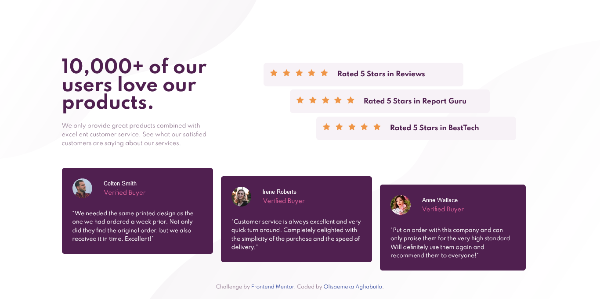

# Frontend Mentor - Social proof section solution

This is a solution to the [Social proof section challenge on Frontend Mentor](https://www.frontendmentor.io/challenges/social-proof-section-6e0qTv_bA). Frontend Mentor challenges help you improve your coding skills by building realistic projects. 

## Table of contents

- [Overview](#overview)
  - [The challenge](#the-challenge)
  - [Screenshot](#screenshot)
  - [Links](#links)
- [My process](#my-process)
  - [Built with](#built-with)
  - [Useful resources](#useful-resources)
- [Author](#author)
- [Acknowledgments](#acknowledgments)

## Overview

### The challenge

This social proof section was designed for both mobile and desktop screen users

### Screenshot

### Links

- Solution URL: [GitHub](https://github.com/olisa187/social-proof-section)
- Live Site URL: [Social proof live site](https://olisa187.github.io/social-proof-section)

## My process

### Built with

- Semantic HTML5 markup
- CSS custom properties
- Flexbox
- CSS Grid
- Desktop-first workflow

### What I learned

Improve in the used of grid and flexbox.

## Author

- Frontend Mentor - [@olisa187](https://www.frontendmentor.io/profile/olisa187)
- Twitter - [@olisa187](https://www.twitter.com/olisa187)

## Acknowledgments

- Frontend mentor.